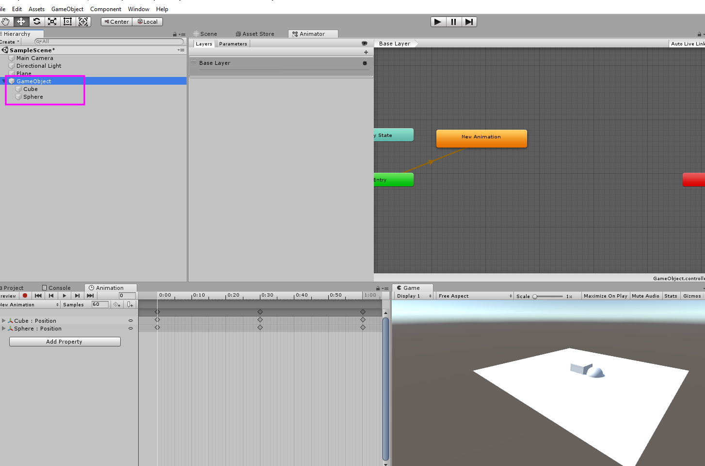

# Understanding Unity 3D Animations
## Include most of the features of Unity 3D Animations
We recommend sequences like below for step-by-step understanding.

1. New Unity 2018 Project - Anim Two Anim in a Game Object
2. New Unity 2018 Project - Anim Texture Change
3. New Unity 2018 Project - Anim Character Setup and Iterate
4. New Unity 2018 Project - Anim Move Forward and Backward
5. New Unity 2018 Project - Anim Blend Tree
6. New Unity 2018 Project - Anim Avatar Mask and Layer
7. New Unity 2018 Project - Anim IK and Joystick
8. New Unity 2018 Project - Anim Texture Change Code
9. New Unity 2018 Project - Anim Texture Scroll

## Unity 3D Animation Projects

### New Unity 2018 Project - Anim Two Anim in a Game Object
  - Play two or more animations(.anim) in a single game object.
  

### New Unity 2018 Project - Anim Texture Change
  - Eye blink animation with texture change.
### New Unity 2018 Project - Anim Character Setup and Iterate
  - Character Setup for Humanoid Avatar and Iterate all animations of a animator controller
### New Unity 2018 Project - Anim Move Forward and Backward
  - Character Setup and move forward/backward with key input
### New Unity 2018 Project - Anim Blend Tree
  - Character Setup and blending multiple animations with blend tree
### New Unity 2018 Project - Anim Avatar Mask and Layer
  - Character Setup and play multiple animations in parallel using layers.
### New Unity 2018 Project - Anim IK and Joystick
  - Character Setup and apply Inverse Kinematics.
### New Unity 2018 Project - Anim Texture Change Code
  - Texture Change animation with C# script
### New Unity 2018 Project - Anim Texture Scroll
Shows that public data member of a C# script can be controlled in the Unity Animator.
  - Texture Scroll animation
